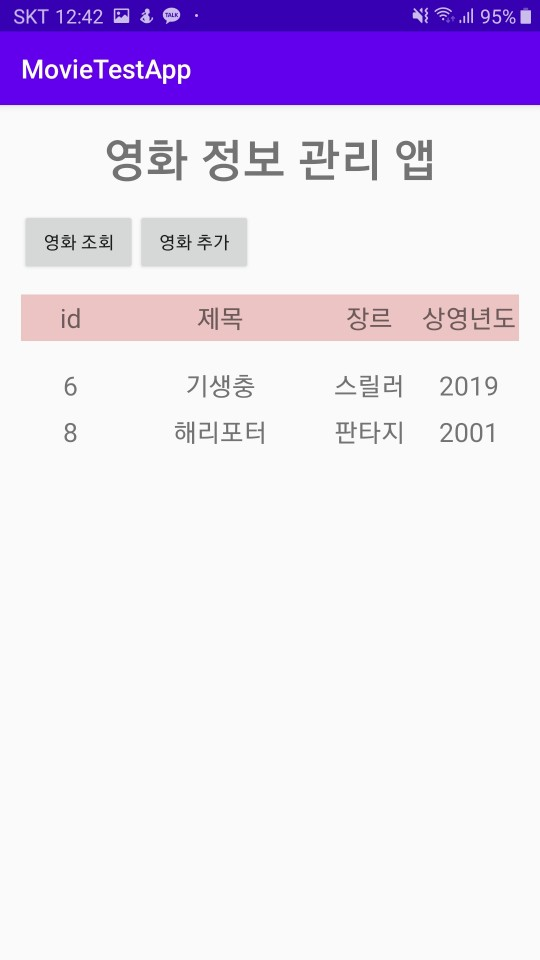
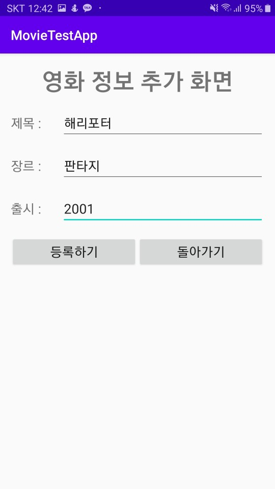
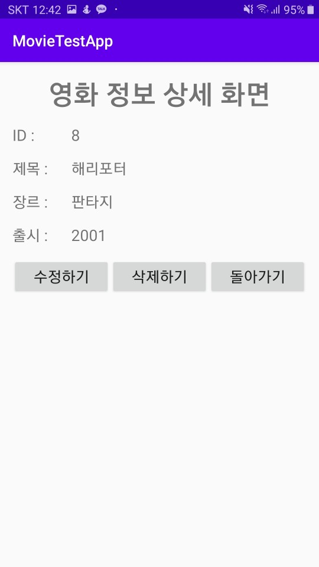

# 영화정보 관리 샘플 앱
 
> 본 application을 실행하면 정상적으로 동작하지 않습니다.  
Local 환경에서만 동작합니다.

영화 정보를 관리하는 연습용 앱입니다.  
아래와 같은 기술을 사용하여 제작하였습니다.

### Server
- `Django REST Framework`
- Sqlite3
- ngrok
### Android
- Kotlin
- DataBinding
- ViewModel
- Koin
- `Retrofit`

 본 프로젝트는 아래의 목표에 집중하여 설계/제작 되었습니다.
 - `Django`를 이용한 Local 환경에서 돌아가는 `REST API` 구현
 - Android Application과 만들어진 REST API 와의 성공적인 통신
 
  

 ---
  

 ## CRUD 기능의 Retrofit 통신
  
 
 

 전체 리스트에 대한 조회 기능를 `GET` Method를 사용하여 통신 가능합니다.

 

영화 정보 추가가 가능합니다. `POST` 방식으로 BODY를 넘겨주는 방식으로 구현했습니다.

 

영화의 상세 정보를 볼 수 있습니다.  
GET 방식에서 Path에 PK(ID)를 넣어주는 방식으로 조회가 가능합니다.

 

이외에도 수정기능`(PUT)` 및 삭제기능`(DELETE)`까지 구현 완료했습니다.

---

## 마치며
직접 통신 가능한 서버를 만들어 프로젝트에 도입을 하고 싶었던 이유로  
간단한 서버를 만들어 Retrofit과 통신하는 허접한 예제까지 만들게 되었습니다.

Django REST Framework를 사용하면 CRUD 기능을 할 수 있는 간단한 API를 만들 수 있음을 본 프로젝트를 통해 확인 했습니다.

앞으로, API를 Custom하는 방법을 알아가며 진행 중인 프로젝트에 도입하는 방식으로 학습을 진행 할 계획입니다.